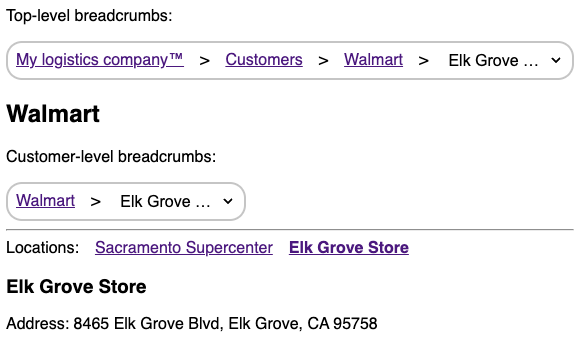
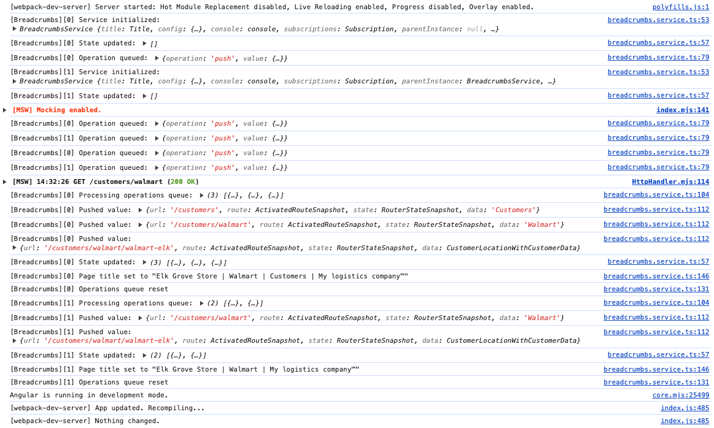

## 1. Features

`@infinum/ngx-nuts-and-bolts/breadcrumbs` provides utilities for setting up breadcrumbs by extending configuration options when defining routes. There is also a service that exposes an observable array of breadcrumb objects, based on the currently active route.

Additionally and optionally, the title of the webpage can also be updated at the same time when breadcrumbs update.

There are no visual components provided, as that is app-specific and should be implemented in the application codebase. Examples on how this could be done are available in the example application.

## 2. Example application

import DemoAppVideoUrl from '../static/img/breadcrumbs/demo-app-recording.mp4';
import ReactPlayer from 'react-player';

<ReactPlayer playing controls url={DemoAppVideoUrl} />

You can run the app with `npm run start:breadcrumbs-example`.

Please check out `apps/breadcrumbs-example` and `libs/breadcrumbs-testbed`. `breadcrumbs-testbed` lib includes most of the application code that is a good reference for how you should implement breadcrumbs in your app as well. It was separated out in a non-publishable and non-buildable lib just to re-use code for both the example app and unit tests.

To showcase various edge cases where navigation might be cancelled because of app-specific route activation/matching and deactivation guards, there are some prompts that happen during navigation that you can play with to see how the app behaves in various cases. This is to simulate real-world examples where you might have guards that prevent navigation if the user is not logged in or that prevent leaving a page with a dirty form.

Some files that might be of particular interest:

- How the service is configured in `apps/breadcrumbs-example/src/app/app.config.ts`.
  - Including the formatter for title updates.
- The way routes are defined in `libs/breadcrumbs-testbed/src/lib/routes.ts`.
- Different resolvers for breadcrumb data in `libs/breadcrumbs-testbed/src/lib/breadcrumb-resolvers`.
- Example of how to render breadcrumb in `libs/breadcrumbs-testbed/src/lib/components/breadcrumbs`.
  - Including conditional rendering based on type of breadcrumb data object. This allows to render not just simple links, but also things like a dropdown selection that triggers navigation.

## 3. Usage

In order to use this feature, you must:

1. Configure the service.
2. Define the type of possible values for breadcrumb data.
3. Set up routes and breadcrumb resolvers.

### 3.1. Service configuration

Before you start using breadcrumbs, you should provide configuration. Add `provideBreadcrumbsConfig` to your global providers.

Function has a generic that represents breadcrumb data (more on that later).

Config object can be defined full, partially, or not be passed at all. If the object is not passed or if some options are missing, corresponding default options will be used. Default logging level is `silent` and title updates are disabled.

### 3.2. Breadcrumbs service

Before we get into defining breadcrumbs in routes configuration, we can first look into how we will get the array of breadcrumbs from application perspective.

`BreadcrumbsService` exposes `breadcrumbs$` public property. A new value will be emitted each time breadcrumbs change (i.e. when navigation completes). Type of the emitted value will be an array of objects of type `Breadcrumb<T>`:

```ts
export type Breadcrumb<T> = {
	url: string;
	route: ActivatedRouteSnapshot;
	state: RouterStateSnapshot;
	data: T;
};
```

Two most important properties are `url` and `data`:

- `url` - a full absolute URL that corresponds to that route (e.g. `/users`, `/users/1`, `users/1/blog-posts`, etc.). Main use case for this is to have a router link in your template that.
- `data` - this will most probably be used for setting the string for the label, but you could also be used for passing on whole objects in case you need more information in each breadcrumb item. It's a generic type of `BreadcrumbsService`, so you will have to define all possible values on the application level (more on that a bit later).

Additional properties `route` and `state` can be used if you need to get some additional information for each individual breadcrumb, based on route that corresponds to a specific breadcrumb item. _Please note that you should not use `state.url`, as that will initially return a static URL that represents the URL at the time the application is loaded, which is not necessarily `/`. Always use `url` property instead of `state.url`_

### 3.3. Breadcrumb data type

Whenever a route is activated, breadcrumb for that route gets resolved. There are two important values that get resolved:

- `breadcrumbData` (required) - this is the data that will be referenced by the `data` property of the `Breadcrumb` object.
- `routeData` (optional) - this is the data that will be passed on via routing for use in components.

`BreadcrumbsService` has one generic `T` that represents `breadcrumbData`. As mentioned in the previous section, `breadcrumbs$` is an Observable of `Array<Breadcrumb<T>>`. In order to work with this service and this observable, you must define all possible types for breadcrumb data.

#### Simple type

The simplest is just a string:

```ts
export type MyAppBreadcrumbData = string;
```

```ts
import { BreadcrumbsService } from '@infinum/ngx-nuts-and-bolts/breadcrumbs';

const breadcrumbService: BreadcrumbService<MyAppBreadcrumbData> = inject(BreadcrumbService);
```

The value of the string could be just some text that will simply be shown as a label.

#### Complex type

If you need more data, you could also define more complex type for breadcrumb data:

```ts
export type MyAppBreadcrumbData = UserModel | BlogPostModel | { text: string; isTranslationKey: string };
```

```ts
import { BreadcrumbsService } from '@infinum/ngx-nuts-and-bolts/breadcrumbs';

const breadcrumbService: BreadcrumbService<MyAppBreadcrumbData> = inject(BreadcrumbService);
```

Now, when you iterate over ` breadcrumbService.breadcrumbs$`, you can have conditional rendering that renders different UI based on whether an individual breadcrumb's `data` value is of type UserModel, BlogPostModel, or a text that can in some cases be displayed directly, or translated if it is a translation key. All of this is in the realm of application codebase. There are some similar examples in the demo app.

This library just provides you utilities to set everything up, but it is up to you to decide what data is part of breadcrumbs and how you render them in UI.

### 3.4. Configuring routes

First, you must wrap your regular route configuration object using `breadcrumbRoute`:

```diff
+ import { breadcrumbRoute } from '@infinum/ngx-nuts-and-bolts/breadcrumbs';

-{
+ breadcrumbRoute({
	path: 'users',
	component: UsersComponent,
	...
}
```

Next, set a resolver:

```diff
- import { breadcrumbRoute } from '@infinum/ngx-nuts-and-bolts/breadcrumbs';
+ import { breadcrumbRoute, breadcrumbStringResolver } from '@infinum/ngx-nuts-and-bolts/breadcrumbs';

breadcrumbRoute({
	path: 'users'
	component: UsersComponent,
+	breadcrumbResolver: breadcrumbStringResolver('Users'}),
	...
})
```

The example above is the simples example where you just set an object literal value for the breadcrumbs. There are options for more complex situations.

This is all that is mandatory. See following section for more details on additional parameters and how to create custom resolvers.

#### Resolver key

Breadcrumb resolvers can set data on the route. There is a default key under which the breadcrumb data is resolved - `BREADCRUMBS_DEFAULT_RESOLVE_KEY` (`breadcrumbs`). Changing this can be useful if you want to read this data from the mounted component.

You can see an example of this in demo app's customer details component (`libs/breadcrumbs-testbed/src/lib/pages/customer-details/customer-details.component.ts`) and route definition where `breadcrumbResolverKey` is set to `location` - matching the input name of the component so that resolved data can be read easily.

#### Boundaries

If you want more than one breadcrumb component, you can also create hierarchical boundaries to show breadcrumbs only for a sub-section of the routing tree. To do this, set `breadcrumbBoundary` in route configuration. Child instance always has a truncated array of breadcrumbs, based on where the boundary was set.

Setting a boundary will create multiple instances of the breadcrumbs service - one instance if there are no boundaries and one additional instance for each boundary. You can reference parent `BreadcrumbService` instance via the `parentInstance` property of the `BreadcrumbService`.

Example app has an example of this - it shows a second breadcrumbs component that is truncated to just show breadcrumbs from customer level downwards:



### 3.5. Resolvers

The goal of breadcrumb resolvers is to:

1. Return data that will be set as breadcrumb data.

   - This is mandatory and has to match the type of data that the docs mentioned earlier.

2. Return route data that will be passed on as route data

   - This is optional and can be used for passing data down via route data independently from data that is set in breadcrumbs object.

#### Built-in resolver

There is a built-in resolver that allow you to resolve breadcrumbs with static data. This can be useful for very simple use-cases. `breadcrumbLiteralResolver` will set breadcrumb data to whatever value you pass it.

#### Writing a custom resolver

Please take a look at `libs/breadcrumbs-testbed/src/lib/breadcrumb-resolvers/customer-details.breadcrumb-resolver.ts` for an example of a resolver. It reads customer ID from route parameter, fetches data about that customer, sets customer name as breadcrumb data and passes down the whole customer object as route data.

## 4. Debugging

When configuring the service via `provideBreadcrumbsConfig`, you can set `logLevel` to `debug` and you should see a verbose debug log in your console:



## 5. Testing

_TODO_
